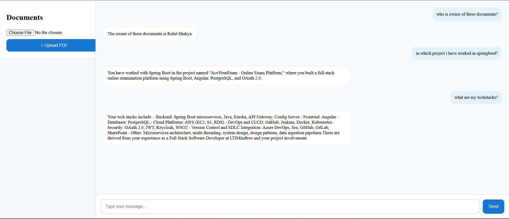

# 🧠 Hybrid RAG + Knowledge Graph (No KG Embeddings)

A full-stack AI system that combines **Retrieval-Augmented Generation (RAG)** with a **Knowledge Graph (KG)** for better accuracy and structured reasoning.

---

## 🚀 Features

- 📄 Upload PDF documents  
- 🔍 Semantic search using FAISS (vector embeddings)  
- 🧠 Knowledge Graph extraction (triplets)  
- ⚡ Hybrid retrieval (RAG + KG)  
- 💬 Chat-based UI (Angular)  
- ⌨️ Enter-to-send messaging  
- 📌 No embeddings used for KG (cost-efficient)  

---

## 🏗️ Architecture

```
User Query
   ↓
Hybrid Retrieval
   ├── RAG (FAISS → Embeddings)
   └── KG (Keyword-based Triplets)
   ↓
Combined Context
   ↓
LLM (GPT-4.1-mini)
   ↓
Final Answer
```

---

## 🧩 Tech Stack

### Backend
- FastAPI  
- FAISS (Vector DB)  
- OpenAI API  
- Python  

### Frontend
- Angular  
- TypeScript  
- CSS  

---

## 📂 Project Structure

```
backend/
├── app.py
├── rag_faiss.py
├── kg_layer.py
├── hybrid_rag.py

frontend/
├── angular-app/
```

---

## ⚙️ Backend Details

### 🔹 RAG Layer
- Chunk documents  
- Generate embeddings (`text-embedding-3-small`)  
- Store in FAISS  
- Retrieve top-k relevant chunks  

---

### 🔹 Knowledge Graph Layer
- Extract triplets using LLM:
  ```
  (subject, relation, object)
  ```
- Stored locally (pickle)  
- Retrieval using:
  - token matching  
  - scoring logic  
- ❌ No embeddings used (cost optimized)  

---

### 🔹 Hybrid Flow

```python
rag_docs = retrieve(query, index, chunks)
kg_facts = query_kg(query)

prompt = f"""
Structured Knowledge:
{kg_facts}

Context:
{rag_docs}

Question:
{query}
"""
```

---

## 🌐 API Endpoints

| Endpoint        | Description                |
|----------------|----------------------------|
| `/upload`      | Upload PDF                 |
| `/ask`         | RAG only                   |
| `/hybrid-ask`  | Hybrid RAG + KG            |
| `/kg-query`    | KG only                    |

---

## 🎨 Frontend (Angular)

### Features
- Chat interface  
- User messages on right, bot on left  
- Enter key to send messages  
- Document upload sidebar  
- Auto-scroll chat  

---

## 🖼️ UI Screenshot

> 📌 Add your UI image here



---

## 🧪 How to Run

### Backend
```bash
pip install -r requirements.txt
uvicorn app:app --reload
```

### Frontend
```bash
cd angular-app
npm install
ng serve
```

Open:
```
http://localhost:4200
```

---

## ⚠️ CORS Setup (FastAPI)

```python
from fastapi.middleware.cors import CORSMiddleware

app.add_middleware(
    CORSMiddleware,
    allow_origins=["http://localhost:4200"],
    allow_credentials=True,
    allow_methods=["*"],
    allow_headers=["*"],
)
```

---

## 💡 Key Design Decisions

- ✅ Hybrid retrieval improves accuracy  
- ✅ KG adds structured reasoning  
- ✅ No KG embeddings → reduces cost  
- ✅ Incremental KG updates from new documents  

---

## 🚀 Future Improvements

- 🔥 Show document sources in UI  
- 🔥 Add streaming responses  
- 🔥 Replace pickle with database (DynamoDB / PostgreSQL)  
- 🔥 Add authentication  
- 🔥 Multi-user support  

---

## 👨‍💻 Author

**Rohit Shakya**

- Full Stack Developer  
- Backend-focused (Java, Spring Boot, Python)  
- Working at LTIMindtree  

---

## ⭐ If you like this project

Give it a star ⭐ and feel free to contribute!
